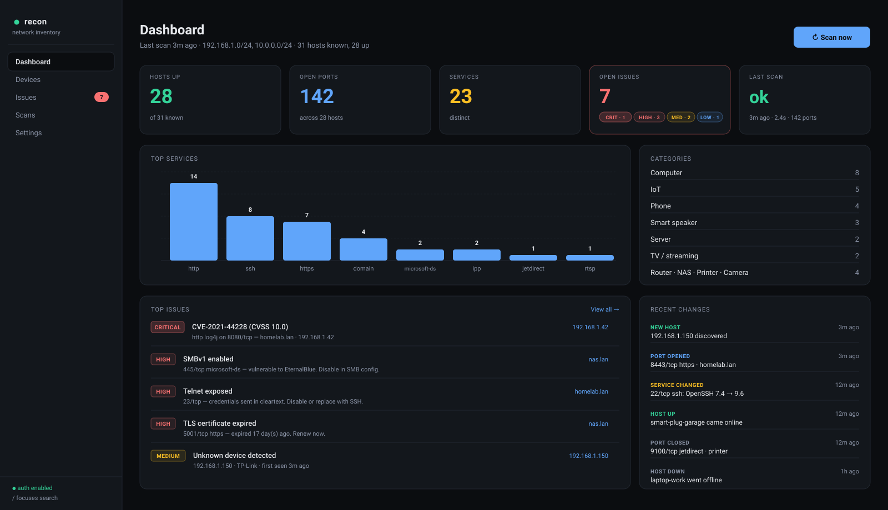

# recon

A self-hosted network awareness tool. Recon scans your home network with
nmap, classifies every device it finds, surfaces problems (CVEs, weak
crypto, exposed services, unknown hosts), and pushes alerts when something
new shows up — all from a searchable dark-themed web UI you run yourself.

It's the answer to "what's on my network, what's it running, and is any of
it broken?"



---

## What's in the box

### Discovery
- **nmap-driven scans**, manual or scheduled (cron). Multi-subnet targets,
  configurable args, NSE scripts on by default for richer service
  fingerprinting.
- **mDNS / Bonjour pass** after each scan to pick up Chromecasts, AirPlay
  devices, printers, and other things nmap fingerprints poorly.
- **Device classification** — every host is auto-tagged (router, NAS,
  printer, camera, smart speaker, IoT, phone, server, computer, TV,
  gaming) from vendor + port signature + OS.
- **Change detection** — every scan diffs against the prior state and
  logs events: new hosts, hosts going up/down, ports opening/closing,
  service version changes.

### Problem detection
Recon's detector engine reads NSE script output and service fingerprints
and raises issues with severity. Currently catches:

- **Known CVEs** via the `vulners` NSE script, severity from CVSS.
- **TLS health**: expired certs, certs expiring in ≤ 30 days, self-signed,
  deprecated TLS versions (SSLv2/v3, TLS 1.0/1.1), weak ciphers
  (RC4, 3DES, EXPORT, NULL, MD5).
- **SSH health**: weak host-key types (DSA, plain `ssh-rsa`), weak KEX
  (`diffie-hellman-group1-sha1`).
- **Dangerous protocols**: SMBv1 enabled, cleartext Telnet / FTP / VNC
  exposed, RDP on LAN.
- **Catch-all** for any NSE script that emits `VULNERABLE` (covers
  `http-vuln-*`, `smb-vuln-*`, etc.).
- **Unknown devices** when a new MAC appears on the network.

Issues have a lifecycle. *State* issues (telnet open, cert expired, CVE
present) auto-resolve once the underlying cause is gone. *Event* issues
(new device) stick until you dismiss them. Any issue can be snoozed for
1 hour / 1 day / 1 week.

### Alerts
- **ntfy.sh push** — point at `https://ntfy.sh` or your self-hosted ntfy.
- **JSON webhook** — POSTs `{source, severity, title, body, url, tags, at}`
  to your URL of choice.
- **Severity threshold** — only get notified at and above the level you
  set (default: high).
- **New-device alerts** — separate toggle, so you can be permissive on
  CVEs and strict on rogue devices, or vice versa.
- Fires **only on newly-opened issues**, not on every re-detection.
- Test button to verify everything is wired up before you trust it.

### UI surface
- **Dashboard** — hosts up, open ports, services, open issues by
  severity, last-scan status; charts for top services, vendors, and
  device categories; top open issues; recent change log.
- **Devices** — searchable, filterable table. Search hits IP, hostname,
  MAC, vendor, OS, label, category, port number, service name. Filter
  by status, category, or has-open-issues. Click any host for the
  detail page.
- **Device detail** — ports with state, service, version, and full NSE
  script output (expandable). Open issues for that host. Full event
  history. Free-text notes and a short label. Delete button.
- **Issues** — full list of open issues sorted by severity, plus a
  snoozed section. Each row has dismiss + snooze.
- **Scans** — every nmap run with status, source (manual / scheduled),
  duration, host counts. Click a scan for that run's diff: events,
  args, errors.
- **Settings** — scanning, schedule, mDNS, notifications, retention,
  auth, danger zone.

### Hardening
- **Concurrency guard** — `BEGIN IMMEDIATE` transaction around the
  scan-claim so two `Scan now` clicks can't race. Returns 409.
- **Optional auth** — bcrypt-hashed password, server-side rotating
  session token, `HttpOnly` + `SameSite=Strict` cookie, constant-time
  compare.
- **Retention** — nightly job purges events, resolved issues, and
  finished scans past your retention window (default 90 days).
- **CSV export** with formula-injection-safe quoting.

---

## Quick start

### Windows (one-click)

1. Clone or download this repo.
2. Double-click **`install.bat`**.
   - Uses `winget` to install Node.js LTS and Nmap (Nmap bundles Npcap).
   - Runs `npm install` and `next build`.
   - Asks once whether to seed sample data so the UI isn't empty on first
     launch.
3. Double-click **`start.bat`**.
   - Starts the production server at <http://localhost:3000> and opens
     your browser.
   - Leave the window open; close it (or Ctrl+C) to stop.

Notes:

- Needs Windows 10 1709+ or Windows 11 for `winget`. If `winget` isn't
  there, install **App Installer** from the Microsoft Store.
- Nmap's installer prompts you to accept the **Npcap** license on first
  run — click through it. Without Npcap, nmap is limited to
  TCP-connect-style scans.
- For SYN scans (`-sS`), MAC vendor detection, and OS fingerprinting,
  Nmap needs admin rights. Right-click `start.bat` → *Run as
  administrator* to get those.
- If `npm install` fails with a native-build error (rare with the
  current `better-sqlite3` pin), `install.bat` will offer to install
  Python 3.12 + Visual Studio C++ Build Tools and retry.
- To run on boot as a background service, wrap `npm run start` with
  [NSSM](https://nssm.cc/) and point the working directory at this folder.

### macOS / Linux

```bash
git clone <this repo>
cd recon
npm install
npm run seed     # optional — populates sample devices so the UI isn't empty
npm run dev      # http://localhost:3000
```

Nmap must be installed on the host running recon:

```bash
brew install nmap          # macOS
sudo apt install nmap      # Debian/Ubuntu
```

For SYN scans, MAC detection, and OS fingerprinting, nmap needs root —
run the server as root, set `setcap` on the binary, or stick to the
default `-sT -sV --top-ports 1000 --script default,vulners` which works
unprivileged.

### Production build

```bash
npm run build
npm run start
```

---

## First-run walkthrough

1. **Open `http://localhost:3000`.** Dashboard is empty (or shows seeded
   data if you said yes during install).
2. **If you used the seed**, head to **Settings → Danger zone → Clear all
   data**, type `RESET` to confirm.
3. **Settings → Scanning**:
   - Set `Subnets / targets` to your real network (e.g. `192.168.1.0/24`).
     Space/comma/newline-separated for multiple.
   - Leave `nmap arguments` at the default for now.
   - Set the cron expression and tick **Enable scheduled scans** if you
     want recurring scans (default: every 6 hours).
4. **Dashboard → Scan now**. The button polls scan status; the UI
   refreshes when it finishes.
5. **Devices**: explore what was found. Click any device for the
   detail page; expand the NSE script output under each port.
6. **Issues**: see what the detector engine flagged.
7. **Settings → Notifications**: pick a ntfy topic
   (`https://ntfy.sh` + any unique-enough string like `recon-home-7xkq2`),
   or set a webhook URL. Save. Click **Send test notification**.
8. **Settings → Authentication**: set a password if your network has
   anyone you don't fully trust. After saving, you'll be redirected to
   `/login` for the next request.

---

## Configuration reference

All settings live in SQLite and are editable from `/settings`:

| Key | Default | Notes |
|-----|---------|-------|
| `subnets` | `192.168.1.0/24` | Space, comma, or newline separated. Multiple targets supported. |
| `nmap_args` | `-sV -T4 --top-ports 1000 --script default,vulners` | Passed verbatim to nmap. `-oX` is appended automatically. |
| `nmap_path` | `nmap` | Override if not on `$PATH` (e.g. `C:\Program Files (x86)\Nmap\nmap.exe`). |
| `schedule_cron` | `0 */6 * * *` | Standard 5-field cron. |
| `schedule_enabled` | `false` | Toggle from settings page. |
| `mdns_enabled` | `true` | Brief Bonjour pass after each nmap scan to enrich hostnames. |
| `ntfy_url` | empty | e.g. `https://ntfy.sh` or your self-hosted ntfy. Leave blank to disable. |
| `ntfy_topic` | empty | Topic name to publish to. |
| `webhook_url` | empty | JSON POST endpoint. |
| `notify_severity_min` | `high` | Severity threshold for issue notifications. |
| `notify_on_new_device` | `true` | Notify when an unknown MAC appears. |
| `event_retention_days` | `90` | Events, resolved issues, and finished scans past this age are purged nightly. `0` disables purge. |

---

## How it works

```
+---------+      +-----------+      +-----------+      +-----------+
| nmap    | ---> | XML parse | ---> | apply +   | ---> | detectors |
| spawn() |      | (xml2js)  |      | diff      |      | + issues  |
+---------+      +-----------+      +-----------+      +-----------+
                                          |                  |
                                          v                  v
                                  +---------------+   +---------------+
                                  | mDNS pass     |   | notifications |
                                  | (bonjour)     |   | (ntfy/webhook)|
                                  +---------------+   +---------------+
                                          |
                                          v
                                  +---------------+
                                  | SQLite        |
                                  | (better-sqlite3)
                                  +---------------+
```

- Server-rendered Next.js App Router. Every page is a server component
  that queries SQLite directly via `better-sqlite3` — no API layer
  in front of reads.
- API routes only exist for mutations (scan trigger, settings, dismiss,
  snooze, login, reset, CSV export).
- `node-cron` runs the scheduled scan job and the nightly retention
  purge in-process.
- mDNS uses `bonjour-service` (pure JS, multicast UDP).
- Detectors run inside the same transaction as the scan apply so the
  state is always consistent.

### Repo layout

```
app/                     # Next.js App Router
  api/                   # mutation endpoints
  devices/, scans/, ...  # pages
  login/                 # auth UI
components/              # client + server components
lib/
  db.ts                  # schema, migrations, types, getSetting/setSetting
  nmap.ts                # spawn + parse + applyScan (the core)
  detectors.ts           # NSE + heuristic issue rules
  classify.ts            # device categorization
  issues.ts              # query helpers, snooze, dismiss
  mdns.ts                # Bonjour pass
  scans.ts               # startScan + executeScan + notification dispatch
  scheduler.ts           # node-cron tasks
  notify.ts              # ntfy + webhook
  auth.ts                # bcrypt + session token + ensureAuth/requireAuth
  retention.ts           # nightly purge
  queries.ts             # search, dashboard, host/port reads
data/
  recon.db               # SQLite (created on first run)
  scans/                 # raw nmap XML, one file per run
windows/
  install.ps1, start.ps1 # called by install.bat / start.bat
scripts/
  seed.ts                # populates demo devices + issues
```

---

## Security model

Recon is built for **trusted home LAN use**. The default posture:

- **No authentication.** Anyone who can reach the port reads the entire
  inventory, every NSE script output, and your issues feed.
- **No TLS.** Plain HTTP on `localhost:3000`.
- **Scans run as whatever user starts the server.** Run as root /
  Administrator only if you need privileged nmap features.

For anything beyond a fully-trusted network, **set a password in
Settings → Authentication**. With auth enabled:

- Every page server-side calls `ensureAuth()` and redirects to `/login`.
- Every mutating API route calls `requireAuth()` and returns 401.
- Password is hashed with bcrypt (cost 10).
- Session token is a 32-byte random hex stored server-side; the cookie
  is `HttpOnly`, `SameSite=Strict`. Token rotates on every login and is
  cleared whenever you change the password.
- Compared with `crypto.timingSafeEqual` to avoid timing leaks.

Other notes:
- nmap is spawned with `shell: false` and explicit argv — no shell
  interpolation. `nmap_path` and `nmap_args` are still admin-level
  config; whoever can write Settings can run arbitrary scans.
- The `/api/scans` POST never accepts target/args from the request body
  — always reads from settings — so an unauth'd LAN client can't
  redirect the scanner at arbitrary hosts.
- CSV export quotes any cell starting with `=`, `+`, `-`, `@`, tab, or
  CR to defeat spreadsheet formula injection.
- ntfy and webhook URLs are user-configurable and fetched
  server-to-server. When auth is off, anyone on the LAN can change
  these; combined with notifications that get triggered on scan
  completion, this is a small SSRF surface. Set a password.

---

## Operations

### Backups

Everything is in `data/`. `cp -r data data.bak` while the server is
running is safe (SQLite WAL); for a cold copy stop the server first.

### Wipe and start fresh

- **From the UI**: Settings → Danger zone → Clear all data (preserves
  settings).
- **From the shell**: stop the server, `rm -rf data/`, restart.

### Logs

`stdout` from the dev server / `npm run start` includes scheduler events,
mDNS warnings, retention summaries, and scan errors. Pipe to a file if
you want history.

### Background service

- **Linux**: a `systemd` unit running `npm run start` with
  `WorkingDirectory=` set to the repo and `Restart=on-failure`.
- **macOS**: `launchd` plist, same pattern.
- **Windows**: [NSSM](https://nssm.cc/) wrapping `npm run start`.

---

## Roadmap

Done so far:

- ✅ Multi-subnet scanning, scheduled + on-demand, concurrency guard
- ✅ NSE-driven detectors (CVEs, TLS, SSH, SMBv1, cleartext protocols)
- ✅ Device classification + mDNS enrichment
- ✅ Notifications (ntfy + webhook) with severity threshold + snooze
- ✅ Filters + CSV export
- ✅ Optional password auth, retention, per-scan detail pages

Not yet:

- 🟦 Scan cancel (kill the running nmap from the UI)
- 🟦 Per-host uptime / availability sparkline
- 🟦 Router integration (DHCP leases, ARP table) via SSH/SNMP/UniFi/OPNsense
- 🟦 Scan-to-scan diff page (pick any two scans, see the delta)
- 🟦 Mobile-responsive polish
- 🟦 Lightweight continuous ping between scans for fast up/down

---

## Stack

- **Next.js 14** (App Router) — single deployable Node app
- **SQLite** via `better-sqlite3` — zero-config persistent storage
- **Tailwind CSS** — dark, dense UI
- **node-cron** — scheduled scans + retention
- **bonjour-service** — mDNS discovery
- **bcryptjs** — password hashing
- **xml2js** — nmap XML parser
- **recharts** — dashboard visualizations
- **zod** — API input validation

## License

MIT. Use at your own risk; this tool runs network scans, and you are
responsible for only scanning networks you have permission to scan.
